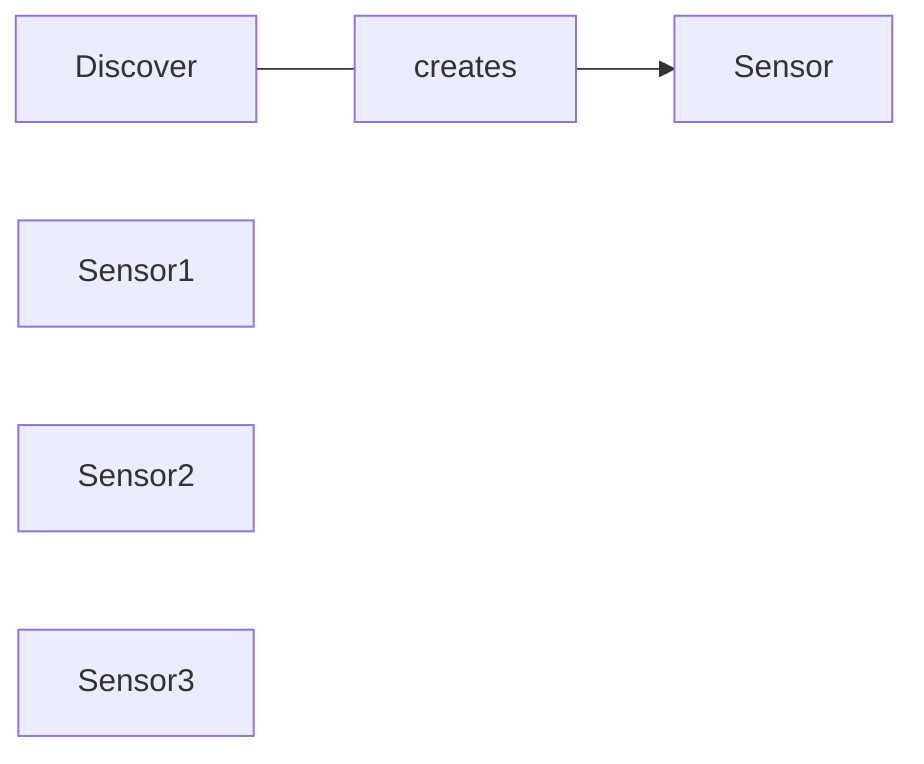

# Guardian 2.0

From Russ's Roadmap - go Faster by Reducing Technical Debt by Refactor “guardian” (the AI processing engine) for scalability and portability, and AI growth by EOY. Note: This may include AI on cameras

Lower OPEX
Reduce Power Consumption/Noise/Heat
Simpler Software Deployments
Simpler Hardware Deployments
Easier Configuration
More control without needing onsite intervention
Less Complexity in network setup
Simplified Updates/Meet Compliance Requirements
Longer Term Video Storage

On demand video preservation/retrieval
More control in camera setup and maintenance
More control in switch setup and maintenance.  (may be included in “less complexity in network setup”)
Better monitoring on cameras
Lower unit costs
TPM integration.  If “guardian” is a full blown box, we need these.
Lower COGS
Optimize GPU performance and allocation
Better delete handling, or in general some kind of specific retention policy
Low power/data mode
remove the need for vpn.
Simplifying the software stack

Better AI threshold management
Better sensor rotation management

POE Switches
Ubiquity Edge Router
Geovision Cameras (Also have IR for low light)
256GB Disks SSDs high write

2 Customers Wifi Cameras (yakima installation has problems)

We hire installers and they adjust cameras.

Common Failures - Lose camera (power cycle or reconnect)

1 minute videos in MP4 queued for review
If a fall, start escalation

Videos start purging after

Push config - didn't know how

Run ansible push out config - 30 mins (No operation experience) Cronjob pull config

- Cloud controllable powerbars
- IOT Enabled connection
- Secrets are logged
- Nginx used as proxy to talk to sensors?

asgi - async webserver (g unicorn)

videotoolbox should be a git submodule to pin a version
Properly package Guardian for deployments?
- https://packaging.python.org/tutorials/packaging-projects/
- https://stackoverflow.com/questions/43658870/requirements-txt-vs-setup-py
- https://stackoverflow.com/questions/1471994/what-is-setup-py

supervisor running as root

Migrate to python 3.9
Log collection from multiple log files for local dev
WTF do I need to copy my ssh creds to local project dir?

Discovery (Custom Resource)
Discovery monitors network for sensors
Discovery creates Controller pod for each discovered sensor

Controller pod talks to atlas
Controller pod configures device
Controller pod monitors device status

- load testing with 30+ cameras
