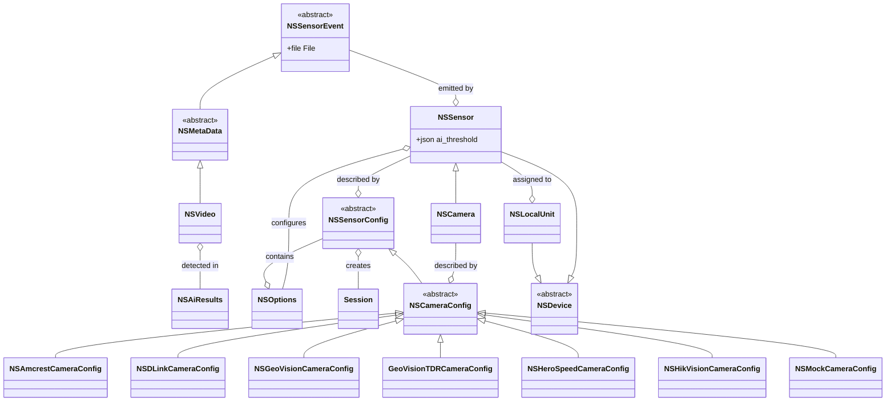
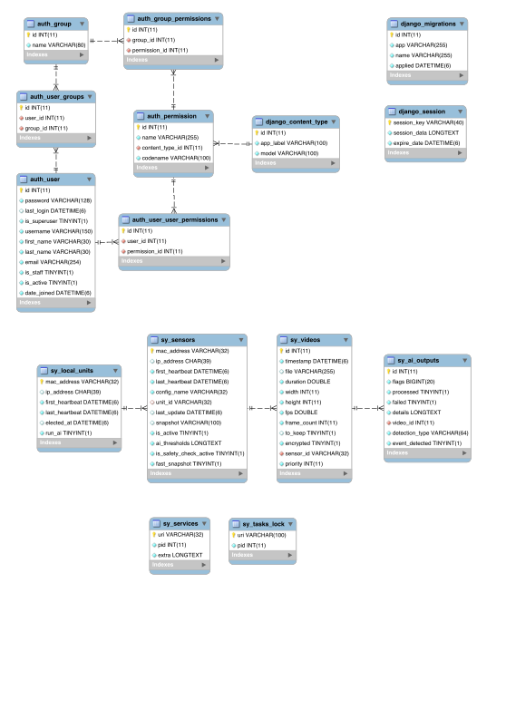

# Guardian

## 1.0

### Class Diagram

<div style="width:768px;">



</div>

| Class       | Description                 |
|-------------|-----------------------------|
| NSAiResults | Stores AI results for video |
| NSSensorEvent | Event from sensor |
| NSMetaData | Event that generated a file |
| NSVideo | Metadata for video |
| NSDevice | Hardware component |
| NSLocalUnit | Guardian computer |
| NSSensor | Generic Sensor |
| NSCamera | Camera proxy |
| NSSensorConfig |  |
| Session |  |
|  |  |
|  |  |
|  |  |

### Entity Relationship Diagram

<div style="width:512px;background-color:#5F5F5F;">



</div>

### Services

- `VideoProcessingService`
  > Processes a raw video into all the standard web compatible formats.
- `VideoUploadService`
  > Manages the video processing pipeline to transcode, upload, and notify Sky.
  >
  > When a video file needs to be uploaded from the Guardian, processes into all the standard web
  > compatible formats. Then uses signed URLs from Sky to upload to media storage. Then notifies
  > Sky that the video has been processed.
- `NSAIService`
  > Service responsible of detecting events using video streams.
  >
  > AI assigns a feature vector to each frames (or just a score for the moment) and then computes a final video score
  > from the all those vectors from the previous minute. This final score (among other information) is then cached on
  > Redis to be used by other processes.
  >
  > With support for running multiple models, the AI service is a bit different than others. One copy of the AI
  > service is running for each AI model. The `run` method is what is executing per model. The other methods like |
  > `start`, `stop`, and `update` need to manage the multiple copies of the service.
- `NSMotionDetectionService`
  > Service responsible of checking if a camera is recording motion.
  > Result of the detection is cached on Redis for other processes to retrieve.
- `SafetyCheckService`
  > SafetyCheck is not a conventional AI service, it assigns a score to the frame of 1
  > periodically to force upload of a video so that staff can periodically check up on residents.
  >
  > This service parses video footage and determines which frames should be uploaded.
- `NSStreamService`
  > Service responsible of opening a stream to a camera.
  > If will generate encrypted videos of MAX_VIDEO_DURATION seconds if motion is detected.
  > All recorded frames are also published on redis for the motion detector and AI services to run.
  > If an event is detected by AI, the produced video is pushed to the server right away.

### Tasks

- `check_data_stream`
  > Checks that video streams are properly opened, meaning that the guardian is streaming to its assigned
  > cameras and them only.
- `cleanup_stream_files`
  > Make sure that we don't have stream files laying around due to unhandled errors.
- `power_cycle`
  > Power cycles cameras using their API.
- `update_network_state`
  > Discovers all sensors and guardians, assign sensors to guardians, then configure sensors.
- `cleanup_network`
  > Delete from the database devices that have been inactive for more than a week.
- `migrate_unit`
  > Run the migration code. It's automatically called after an update, so you should probably not call it yourself.
- `update_unit_state`
  > Get updates from Sky and synchronize local database.
  >
  > From the server the guardian retrieves:
  >   - Some settings that could be customized from the web ui
  >   - Which videos should be uploaded.
  >   - If the sensors are active or not (we don't stream to inactive sensors)
- `setup_unit`
  > Contact the main server to setup this unit.
- `upload_videos`
  > Upload videos to Sky.
  >
  > Only uploads videos marked as to_keep. This is either videos flagged by AI or videos that
  > have been requested by Sky (pre and post fall buffer video).
- `upload_videos_sensor`
  > Upload all videos for a single sensor.
- `upload_videos_range`
  > Upload videos within a specific time range.

sy_toolbox.VideoStream - responsible of generating a video from another video or a camera.

NSVideoStream - Wrapper for sy_toolbox.VideoStream
NSVideoStream --o NSCamera : create filename for
NSVideoStream --o NSCamera : call insert_frame
NSVideoStream --o NSCamera : call get_last_ai_output
NSVideoStream --o NSCamera : call should_process_video
NSVideoStream --o NSCamera : log video processing results for
NSVideoStream --|> sy_toolbox.VideoStream

SafetyCheckInterface - Safety Check interface. This sends alarms from a room periodically for review.

## Questions

Doug Today at 12:33 PM
Is support for wifi cameras a necessary evil going forward?
Ken  11 minutes ago
yes
Ken  11 minutes ago
they want to be easy to buy.  if you don’t want to pay for and coordinate low voltage wiring guys to come in and bug your residents, wifi is a good option. (edited)

Russ  3 days ago
@Aaron @Ken those wifi cameras have a problem during peak wifi load in the afternoon. I have been working with their facility on this. And, oddly enough i seem to be able to get on the HTTP interface when our back end Guardian Code cannot, so I suspect we have a bug in our back end guardian code.
Doug starts Monday, and this will be one of his goals - to replace the video toolbox with a more modern library such as OpenCV.

Ken  2 hours ago
@Doug Yakima is a wifi site and it is very glitchy.  “Check Processed Videos” is the guardian comparing the list of cameras really streaming with the list that Sky expects to be streaming.  If there is a difference it alerts.  In a hardline environment, it means that the camera needs to be restarted in one of a couple of ways.  In yakima it means that somebody is watching Netflix or making popcorn something equally innocuous.

- Log shipping - Low-bandwidth concerns?
- Metrics?
- Security? Oauth?
- State / How is AI DB data added/updated?

## Operations

Ken  11:17 AM
we have custom built automation around nagios telling opsgenie to wake us up, then make a jira for the incident.  when it resolves it close the jira and closes the opsgenie alert.
:+1::skin-tone-3:
1

11:17
it works but its a mess.
11:20
You may hear about “onzra” or “jose”.  this is a contracting company that is still around some.  Before Jason and I got here the staff was a mess.  Onzra solidified that to some extent.  Talented but kind of annoying and since they are paid by the hour they tend to make very elaborate solutions to problems that could be solved some other way.
11:20
so all our monitoring was set up by onzra.  I’m waiting on atlas and k8s to overhaul that.

## Thoughts

Slack is not a great tool for escalations
Google drive is not a great tool for managing support docs


## Week in Support

Ken  1 hour ago
@Doug we sent out a tech for this after a long back and forth with the facility.  He found an actual physical cabling issue, fixed it and the camera came back online.  This is pretty rare, but when it happens it seems to involve half the company and a bunch of emails.

Ken  1 hour ago
@Doug switches alarm when the router can’t ping them.  they’re kind of dumb and we can’t manage them over command line.  sometimes we have to get into the UI, which also sucks.
This is an area I’d like to improve.  Ubiquiti makes managed switches for pretty cheap but maybe more expensive than what we’re paying now for netgears.

Ken  2 hours ago
@Doug if a site has 2 guardians, they divide the camera load using consistent hashing of the mac addresses.  Divide up the ring using the same general principle as cassandra dividing up data to nodes.
However the monitoring scripts are not that smart.  It knows which cameras should be recording and if they’re not, each guardian alerts.  not critical, but annoying.

@Doug when guardians are up but can’t get out to the world, they start piling up videos for like 30 minutes.  That number is by design and is the source of occasional debate.  When a guardian was offline but can finally get back to the internet, it alerts on this and it clears up.
Corollary, if there’s a problem with sky, every guardian in the fleet blows up at the same time with this alert. I just put my phone in a drawyer.

Ken  2 hours ago
@Doug
The power probably went out and the facility’s modem (we don’t control) isn’t letting us out.  We’ll have to engage somebody on site, maintenance guy usually, to reboot it, then try to get on and bring everything back up.  This requires coordination between a busy maintenance guy and somebody capable of fixing the rig.

@Doug
Guardians don’t reboot themselves.  They have encrypted drives, but when they boot they wait on the boot password to be hand-entered over the IPMI.
This is a long running background project called ‘autoboot’ that I have successfully solved on the guardian in my house but doesn’t work in the field.  Additionally the way I was solving it was not stable, so its the first project next sprint.  Once we solve this it will eliminate about 1/4 to 1/3 of our incidents.

Ken  2 hours ago
@Doug our ansible requires some touch to get it to NOT set up monitoring on sites that are not installed yet.  We’re not very good or consistent about that yet.  Meaning all of the 3 alerts pictured above are for sites that are not live yet.  The fix was to comment them out and re-deploy our nagios config.  Since nagios doesn’t clear alarms for hosts that disappear from its inventory, I hand-cleared the alarms.

Ken  2 hours ago
@Doug The facility’s ISP failed over from ‘primary fiber’ to ‘secondary fiber’.  Everything went down hard.  Got with their IT guy over email and after some back and forth their ISP put it back to primary and we were able to get in.  got in and brought everything back online.

Ken  2 hours ago
@Doug The IT guys at the facility’s corporate office added a circuit on the site and forgot about us.  I had to email the contact we had.  The NAT still worked but the public IP changed.  We have Teamviewer on the boxes as a backdoor and that was still working.  Meaning traffic could flow out but we couldn’t get in.  Once I got the public IP I got on the guardian, then ssh’ed to the router.  Then hand entered the new public into the boot config and rebooted the router.  Everything came back up and alarms cleared.

Ken  2 hours ago
@Doug Yakima is a wifi site and it is very glitchy.  “Check Processed Videos” is the guardian comparing the list of cameras really streaming with the list that Sky expects to be streaming.  If there is a difference it alerts.  In a hardline environment, it means that the camera needs to be restarted in one of a couple of ways.  In yakima it means that somebody is watching Netflix or making popcorn something equally innocuous.

Ken  2 hours ago
@Doug the netgear switch appears to have had a problem and 1/2 of the cameras a the facility.  Got a security guy on the line and he powercycled both switches.  The switches and cameras are kind of dumb so once they could get network again everything started working and alarms cleared.

Ken  2 hours ago
@Doug monitoring script on the box notified our nagios that it couldn’t connect to our vpn.  got on the router through the exposed public IP, yep its wedged.  Got on the vpn on AWS and re-started the connection with this facility.  Alarm cleared itself after the monitoring script ran again.

@Doug
This one is an interesting one.
Configs show 1 switch and 2 guardians.  Turns out there’s 2 rooms in the facility.  Router, switch, and guardian1 are in 1 room. guardian2 are in another room, with a second switch that is not in our configs.  currently can’t get to guardian 2.  After poking around and doing some arp investigations on the router we determined that our configs are wrong, switch 2 is offline, meaning there’s either a wiring problem (unlikely) or a power problem in room 2.  Going to have a maintenance guy power cycle room 2 and check breakers.  If that works, Alex will bring up g2 and fix the configs once we can see switch 2.

Johnney Miller  14 hours ago
Summary:
SafelyYou equipment is plugged into a power strip managed by a 3rd party equipment.
The 3rd party equipment (power strip) appears to be broken since every outlet on strip is no longer powered. The 3rd party will send service tech - no confirmation on date.
Johnney asked Todd (Building) to bring an extension cord to plug Guardian. Todd will check, but is occupied and unable to check now.
Johnney has sent email of service interruption to community including Todd (Building) + Sylvia (ED).
No action for SY - Johnney can continue to follow up tomorrow with Todd to restore power by other means and confirm time of service technician.

## From 2020 Plan

ffmpeg processing moved to guardian
operational reliability

3mb / minute


Doug Today at 12:33 PM
Is support for wifi cameras a necessary evil going forward?
18 replies

Ken  4 hours ago
yes

Ken  4 hours ago
they want to be easy to buy.  if you don’t want to pay for and coordinate low voltage wiring guys to come in and bug your residents, wifi is a good option. (edited)


Jason  13 hours ago
Bill of Materials for current guardians.
Word Document
SYi_0729.21a.doc - https://safelyyou.slack.com/files/U01CMP14QAV/F02F5BZFJF2/syi_0729.21a.doc

PART# MBD-X12SCA-F
- 1 Super X12SCA-F, W-1200 or i3/i5/i7, 2xPCIe(x16),Video,HD Audio,2xGB LAN,4xSATA3+R,M.2,IPMI,D4(128GB) $1650
- 1 Intel® E-2286G-4.0Ghz/6C/12T, 12M, 8GT/s, 95W LGA1151 CPU
- 1 Supermicro SNK-P0046A4,Active HS/LGA1151,
- 2 16GB DDR4-2666Mhz,ECC/Unbuffer Sdram, *SMC Certified*, 32GB memory
- 1 Toshiba XG6,256GB NVMe* M.2 SSD(TLC), 256GB M.2 SSD
- 1 Supermicro SC523L-505, 2U RM, Front I/O, 2x 3.5" Int HDD+1x Slim DVD Bays, 505W, Short-Depth(14.5")
- 1 CBL-0237L, SFF 8087 to 4 SATA 70CM with Sideband, PBF
- 2 NY Quadro P1000 4GB GDDR5 4Mini VGA,


Jason  13 hours ago
Power Cycling Guide we send to facilities when we need assistance. https://docs.google.com/presentation/d/1a6q-ORKxJM5ba34qZv795IldcRcK4D_bF2QFal1hLgw/edit#slide=id.p

Johnney Miller  12 hours ago
Sorry Doug, only got chance to breathe now… You can try these below.

- Geovision 4MP LOW WDR PRO DOME (GV-TDR4703-2F) - https://usa.ingrammicro.com/site/productdetail?id=A300-8NF061
- GeoVision GV-MOUNT 213 Mounting Box for Network Camera FOR ADR2701 / 4701 (Ceiling Mount) - https://usa.ingrammicro.com/site/productdetail?id=A300-3DC721
- Netgear 18-port switch (GS716TP) - https://usa.ingrammicro.com/site/productdetail?id=A300-6RT668
- Netgear 26-port switch (GS324TP) - https://usa.ingrammicro.com/site/productdetail?id=A300-6AF176
- Ubiquiti Edgerouter (ER-X) - https://usa.ingrammicro.com/site/productdetail?id=A300-ZH3761
- Tripp Lite Surge Protector Rackmount 14 Outlet 15' - https://usa.ingrammicro.com/Site/Search#keywords%3a496655
- Tripp Lite Power Strip Rackmount Metal 120V 5-15R Right Angle 12 Outlet 1U - https://usa.ingrammicro.com/site/productdetail?id=A300-600784
- Tripp Lite 6U Wall Mount Rack Enclosure Server Cabinet Switch Depth Deep - https://usa.ingrammicro.com/Site/Search#keywords%3a3H6471
- Tripp Lite 12U Wall Mount Rack Enclosure Server Cabinet Hinged Doors/Sides - https://usa.ingrammicro.com/Site/Search#keywords%3aY96346
- MB: Super X12SCA-F, W-1200 or i3/i5/i7, 2xPCIe(x16),Video,HD Audio,2xGB LAN,4xSATA3+R,M.2,IPMI,D4(128GB) https://www.supermicro.com/en/products/motherboard/X12SCA-F
- CPU: Intel® i9-10900F-5.2Ghz/10C/20T, 20M, 8GT/s, 65W LGA1200 CPU  https://ark.intel.com/content/www/us/en/ark/products/199329/intel-core-i9-10900f-processor-20m-cache-up-to-5-20-ghz.html
- Fan: SNK-P0046A4, 2U Active Heatsink for LGA1156 CPU 
- MM: 16GB DDR4-2666Mhz,ECC/Unbuffer Sdram, *SMC Certified*,                   
- SSD: Toshiba XG6,256GB NVMe* M.2 2280 SSD,  *SMC Certified*,                     
- CA: Supermicro CSE-523L-505, 2U RM, Front I/O, 2x 3.5" Int HDD+1x Slim DVD Bays, 505W, Short-Depth(14.5") https://www.supermicro.com/en/products/chassis/2U/523/SC523L-505B
- CB: Supermicro CBL-0237L Cable,


Ozeki Camera SDK
How to connect to your Geovision IP camera
https://camera-sdk.com/p_6674-how-to-connect-to-a-geovision-camera.html


Visual Toolbox
- Motion detection
- Capturing RTSP stream - OpenCV
- Boost compiles C++ classes to interact with python
Problem Motion algo is questionable.
NS prefix -
Celery task runner
Tmp is used heavily
File

## Nextgen Guardian

State DB

- Migrations: https://github.com/golang-migrate/migrate
- Config file(s)
- Relational Database
- Key value store (https://github.com/etcd-io/bbolt)
- Transcoding
  - https://github.com/floostack/transcoder
  - https://github.com/VKCOM/joy4
  - cgo Bindings https://github.com/giorgisio/goav

## Stack

- k3s
- Golang
- Filesystem (config)
- https://github.com/etcd-io/bbolt - state store (or just use files)

Kubernetes: (routing, services, compute, gpu)
 - https://kubernetes.io/docs/tasks/manage-gpus/scheduling-gpus/#deploying-nvidia-gpu-device-plugin
 - https://dev.to/mweibel/add-nvidia-gpu-support-to-k3s-with-containerd-4j17


- Prove out k3s with nvidia gpu


https://safelyyou.atlassian.net/browse/GR-262 - Epic

https://safelyyou.atlassian.net/browse/GR-244


https://safelyyou.atlassian.net/browse/GR-263
Jason Gerard
September 7, 2021, 2:44 PM
Edited

Retain video for 24 hours (if can’t connect?)

Move video processing to lambda (https://aws.amazon.com/blogs/media/processing-user-generated-content-using-aws-lambda-and-ffmpeg/)

Better motion detection (make sure it’s actually working)

Russell Burt
August 23, 2021, 1:10 PM

also talked to @Alex. Told him his new algorythms should plan on limited resources, he says it is faster to swap out an ai algrythm to evaluate a minute of video in the card, than it is to load the video. So maybe it time slices the python, and not the video. Anyway, probably should talk to Raghav and Alex on this.


RTSP - https://en.wikipedia.org/wiki/Real_Time_Streaming_Protocol
Need golang support

Local DB synced to cloud
CQRS system
- All commands can be executed over wire or locally on machine
- CI/CD - Github Actions / AWS CodeCommit, AWS CodePipeline, and AWS CodeDeploy, as well as Git and CodePipeline Lambda actions
- Get visual toolbox working with Golang (Boost for GO?)
- ATLAS-based custom resource for deploying changes to env?
- Support/monitoring intelligence seems to be a feature of the system.
  - Design for a semi-technical support team?

- [ ] Videotoolbox and guardian must be built on the same platform
  - [ ] Caffe deeplearning fork
  - [ ] py-faster-rcnn - python matlab
  - [ ] safely-run - https://github.com/SafelyYou-Inc/ai-realtime

- Testing... need to configure docker compose guardian / cameras and export sky db
- Can run guardian headless? Or with Sky Testing Harness?
- PyTorch 1.6.0 does not have an ARM64 build
- VideoToolbox test_stream fails when run under x86_64 emulation QEMU
  - `"ffmpeg" qemu: uncaught target signal 11 (Segmentation fault) - core dumped`
- nmap process will need to change (kubernetes internal network and the connected network)
  - Need a external network scanner pod
- To copy stream from mock camera
  - `./manage.py sensors -d`
  - `./manage.py task update_unit_state`
  - `ffmpeg -i rtsp://10.24.8.24:554/stream -c copy out.mp4`

## Build

```
mkdir -p pkg lib
git clone git@github.com:SafelyYou-Inc/ai-realtime.git pkg/safely-run
git clone git@github.com:SafelyYou-Inc/py-faster-rcnn.git pkg/py-faster-rcnn
git clone git@github.com:SafelyYou-Inc/caffe.git pkg/caffe
git clone git@github.com:SafelyYou-Inc/video-toolbox.git pkg/toolbox
pushd pkg/toolbox
docker build --platform linux/x86_64 -t video-toolbox:latest -f build.Dockerfile .
popd
id=$(docker create --platform linux/x86_64 video-toolbox:latest)
docker cp "${id}":/opt/safely-you/lib/sy_toolbox.so lib/
docker rm -v "${id}" > /dev/null
rm -f tb-ai-lib.tar.gz
tar -czf tb-ai-lib.tar.gz .
```
